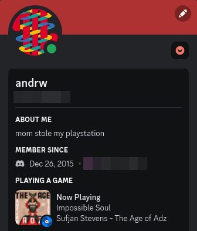

# Discord rich presence using Listenbrainz



This program uses a few API's (libraries) in order to display a Listenbrainz user's now playing song as a rich presence status in Disord, those being:

- [ListenBrainz](https://listenbrainz.readthedocs.io/en/latest/index.html) ([pylistenbrainz](https://pypi.org/project/pylistenbrainz/))
- [MusicBrainz](https://musicbrainz.org/doc/MusicBrainz_API) ([musicbrainzngs](https://pypi.org/project/musicbrainzngs/))
- [Discord RPC](https://discord.com/developers/docs/topics/rpc) ([pypresence](https://pypi.org/project/pypresence/))

Make sure to check the terms of use for these before using this application.

When ran, it will fetch the now playing song from ListenBrainz, fetch the album art from MusicBrainz, and then update the user's Discord status. It is designed to do as little work as possible while updating as frequently as possible.

## Installation

- Clone the repository and navigate in
```
git clone https://github.com/qouesm/listenbrainz-discord-presence.git
cd listenbrainz-discord-presence
```

- Install the required dependancies

```
pip install -r requirements.txt
```

- Make a copy of the enviroment variable template
```
cp .env.template .env
```

- Create an application in the [Discord developer portal](https://discord.com/developers/applications)
  1. Click on **New Application**, provide a name, agree to the terms, and click **Create**
    - Note: The name of the application will be the first line in the rich presence (Now Playing in the example)
  2. Copy the **Application ID** and set it as `DISCORD_CLIENT_ID` in `.env`
  3. The program is hardcoded to use an art asset (navidrome) as the `small_image` or as the `large_image` if no album art can be found. Navigate to your application in the developer portal:
    - Under **settings**, click on **Rich Presence** > **Art Assets**
    - Under **Rich Presence Assets**, add an image with **Add Image(s)**, and make sure it is named `navidrome` (the logo I use is included in the repository)
    - Make sure to **Save Changes**

- In `.env`, set `LISTENBRAINZ_USER` to your ListenBrainz username

- In `.env`, set the `MB*` variables [accordingly](https://musicbrainz.org/doc/MusicBrainz_API/Rate_Limiting#Provide_meaningful_User-Agent_strings)

- Run the application
```
python main.py
```

- (Optional) Run the application with debug logs

```
python main.py --log debug
```
